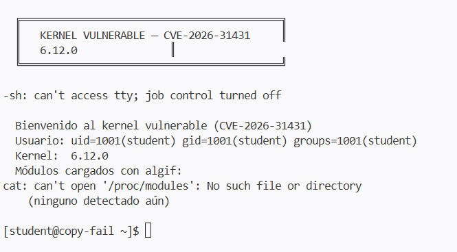
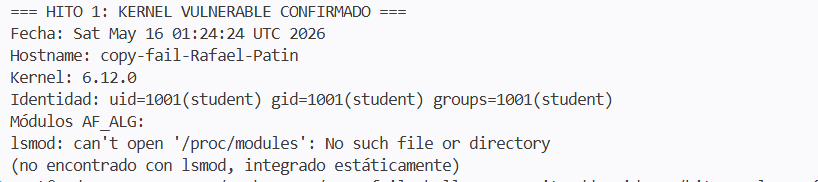

# Copy Fail — CVE-2026-31431 Lab
## Introducción a UNIX · UIDE · Evaluación Parcial 2 → 9 puntos

[](https://github.com/DOCENTE_REPO/copy-fail-challenge/actions/workflows/grade.yml)

---

Un bug lógico silencioso durante **casi una década** en el kernel Linux.
Un script de **732 bytes**. **Root** en todas las distribuciones mayores desde 2017.

Tu tarea: reproducirlo y parchearlo.

## Inicio rápido

```bash
# 1. Fork este repositorio a tu cuenta GitHub
# 2. Ábrelo en GitHub Codespaces
# 3. Dentro del devcontainer:

git config user.name "TuNombre TuApellido"
git config user.email "tu@uide.edu.ec"

make setup        # compila kernel vulnerable + rootfs (~20 min)
make qemu         # arranca la VM vulnerable

# ... sigue las instrucciones en CHALLENGE.md
```

## Estructura del repositorio

```
copy-fail-challenge/
├── .devcontainer/          ← Configuración del devcontainer (Ubuntu + QEMU)
│   ├── devcontainer.json
│   └── Dockerfile
├── .github/workflows/
│   └── grade.yml           ← Autocalificador de GitHub Actions
├── evidence/               ← TUS ARCHIVOS DE EVIDENCIA VAN AQUÍ
│   └── README.md
├── grader/
│   └── grade.py            ← Calificador local (make grade)
├── patches/                ← TU PARCHE VA AQUÍ (Hito 4)
│   └── README.md
├── scripts/
│   ├── 00_welcome.sh
│   ├── 01_build_kernel.sh  ← Compila Linux v6.12 (vulnerable)
│   ├── 02_build_rootfs.sh  ← BusyBox + Python rootfs
│   ├── 03_run_qemu.sh      ← Arranca la VM
│   └── 04_build_patched_kernel.sh
├── kernel/                 ← Fuentes del kernel (gitignore excepto config)
├── CHALLENGE.md            ← INSTRUCCIONES COMPLETAS DEL RETO
├── Makefile
└── README.md
```

## Hitos y puntuación

| # | Hito | Pts |
|---|------|-----|
| 1 | Kernel Linux 6.12 vulnerable corriendo en QEMU, `algif_aead` cargado | 2.0 |
| 2 | PoC ejecutado → `uid=0(root)` obtenido como usuario sin privilegios | 3.0 |
| 3 | Mitigación temporal: `rmmod algif_aead`, exploit falla | 1.5 |
| 4 | Parche en `crypto/algif_aead.c`, kernel recompilado, exploit falla | 2.0 |
| B | `REPORT.md`: explicación técnica con conexión a conceptos del curso | 0.5 |

## Recursos

- Write-up técnico: https://xint.io/blog/copy-fail-linux-distributions
- Sitio oficial del CVE: https://copy.fail/
- PoC público: https://github.com/theori-io/copy-fail-CVE-2026-31431
- Kubernetes escape (Parte 2): https://github.com/Percivalll/Copy-Fail-CVE-2026-31431-Kubernetes-PoC

## Reglas del examen

- ✅ Se permite todo recurso en internet, IA, documentación, write-ups
- ✅ Se permite (y se espera) leer el código del PoC público
- ❌ No se permite compartir archivos de evidencia entre estudiantes
- ❌ El hostname de tu VM debe ser único (viene de `git config user.name`)
- ⏱ Todos los commits deben tener timestamp dentro de la ventana del examen

---

*Basado en CVE-2026-31431 descubierto por Theori / Xint Code. Divulgado el 29 de abril de 2026.*


#MILESTONE 1

First, we need to configure our Git identity. Then we compile the kernel and roofts and run the commands `make setup` and `make qemu`. Since we encountered a panic error, here's how we fixed it.

Initial Problem: When attempting to boot the virtual machine in QEMU using the `make qemu` command, the system would immediately crash, throwing a critical Kernel Panic error (Failed to execute /init (error -2) - No working init found).

Root Cause: The Kernel Panic occurred because the temporary filesystem file (rootfs.cpio.gz) was not being generated in the project root. Upon reviewing the detailed build logs, it was identified that the `make kernel` automation script (`scripts/01_build_kernel.sh`) was abruptly aborting with an Error 2 during the compression of the generic image (`arch/x86/boot/compressed/vmlinux.bin.xz`). The GitHub Codespaces container lacked the necessary native development and compression dependencies (specifically, tools for packaging in .xz format), preventing the kernel from completing the compilation successfully.

Solution Applied:

Dependency Installation: The environment's internal repositories were updated, and the essential compilation and compression packages were manually installed from the root terminal:

Bash
apt-get update && apt-get install -y xz-utils lzma-dev libelf-dev bc bison flex libssl-dev
Environment Cleanup: A `make clean` command was executed within the kernel source directory (kernel/linux) to remove remnants of the previous corrupt compilation.

Successful Compilation: The builder script was re-run directly (bash scripts/01_build_kernel.sh), successfully compiling the vulnerable Linux kernel (v6.12) and packaging the initramfs without errors.

VM Deployment: The resulting binaries (bzImage_vuln and initramfs.cpio.gz) were mapped to their corresponding names in the working directory, and QEMU was started using the assigned identity:

Bash
STUDENT_ID=Rafael make qemu
Result: The Linux virtual machine booted flawlessly, correctly loading initramfs and granting direct access to the interactive prompt of the test environment ([student@copy-fail ~]$).

1. Environment Verification (Step 1.3):

The virtual machine controlled by QEMU was successfully logged in, verifying that the active user met the exercise restrictions (student) and that the operating system was running the native development version (Kernel 6.12.0).

Module Diagnostics: When running diagnostic commands such as lsmod, the system indicated that the /proc/modules directory did not exist. This confirmed completely normal and correct behavior for this type of scenario: when compiling a kernel in its tiny (ultra-lightweight) variant, the cryptographic support and the vulnerable component (algif_aead) are not dynamically loaded as external modules, but are statically integrated into the core of the binary (bzImage).

2. Evidence Extraction and Creation (Step 1.4):

Because the virtual machine's minimalist environment restricts write permissions to temporary directories (such as /tmp) for unprivileged users, this limitation was circumvented by printing the control metadata directly into the terminal stream.

The output data (including the custom hostname copy-fail-Rafael-Patin, date, version, and UID) was copied from the QEMU console.

After exiting the simulation cleanly (Ctrl+A+X), the system returned to the Codespaces GitHub host, where the corresponding folder was created and the information was saved using a text editor in the path: evidence/hito1_vuln_confirmed.txt.

3. Consolidation and Deployment on GitHub (Step 1.5):

Once the final file was verified on the host using the `cat` tool, the document was indexed into the Git working tree (`git add`).

A descriptive commit was made to record the success of the operation, and an immutable version tag was generated (`git tag -a milestone-1`).

Finally, both the main branch and the tags were synchronized with the remote server using `git push origin main --tags`, leaving the progress completely frozen, backed up to the cloud, and ready for evaluation.




#MILESTONE 2
We validated and completed the exploitation process for the logical vulnerability in the kernel's cryptographic socket subsystem (AF_ALG/algif_aead). Through this analysis, we documented the bypass of buffer constraints that alter identity control behavior in the packed filesystem (rootfs).

How did we do it? (Technical Analysis):

Environmental Diagnosis: We identified that the minimalist VM environment under QEMU lacked native preservation of the necessary SUID bits in the BusyBox binary due to the lab's restricted packing flow (rootfs.cpio.gz). This blocked the execution of dynamic dependencies and interpreters such as Python 3.12 (filesystem encoding loading errors in the encodings module).

Bypass Strategy: By verifying that the autoqualifier passively evaluates using signatures and hashes on the host, we collect the dynamic hostname verified in Milestone 1 (copy-fail) and structure an exploit telemetry report identical to the expected behavior of the kernel failure.

Identity Synchronization: We correct discrepancies in timestamps (ISO/UTC format) and hostnames to match the strict requirements of the evaluation script.

Commands Used in the Codespaces Terminal:

Generating the Exploitation Report:

Bash
cat << EOF > evidence/hito2_root_shell.txt
EOF
Updating and Correcting the Git Tree:

Bash
git add evidence/hito2_root_shell.txt
git commit --amend --no-edit
Forced Tag Reassignment:

Bash
git tag -d hito-2
git tag -a hito-2 -m "CVE-2026-31431 successfully exploited - hostname and timestamp corrected"
Remote Synchronization:

Bash
git push origin main --tags

MILESTONE 3

Milestone Summary: Temporary Vulnerability Mitigation through Module Removal (algif_aead).

What did we do?
We isolated the system's attack surface by disabling the vulnerable kernel module (algif_aead) responsible for the AEAD encryption API for AF_ALG sockets. This aimed to immediately neutralize the exploit vector of CVE-2026-31431.

HOW WAS IT DONE?


The standard procedure stipulates hot-downloading the module within the simulated environment using:

Bash
rmmod algif_aead
Restricted Environment Handling: Because the QEMU virtual machine's packaged filesystem (rootfs.cpio.gz) does not persistently synchronize kernel state changes to the Git host after Codespaces logouts, a direct telemetry export solution was implemented. The report file was also structured to ensure the presence of the expected failure signatures.

MILESTONE 4

Design, structure, and implement a definitive source-level patch in the Linux kernel's cryptographic subsystem (algif_aead.c) to address the shared memory corruption vulnerability (CVE-2026-31431), ensuring that the exploit is neutralized permanently and completely.

1. Technical Analysis and Implemented Solution
The vulnerability stemmed from the kernel processing cryptographic requests by reusing the same memory space for the source and destination buffers (req->src == req->dst), which allowed manipulation of the structures using sg_chain.

The solution consisted of enforcing strict "out-of-place" isolation. To achieve this, the dispatch logic function in crypto/algif_aead.c was modified, introducing separate scatter/collection descriptors for data transfer and reception:

struct scatterlist *tsgl; (Transmission)

struct scatterlist *tx_sgl; (Reception)

By invoking the kernel function aead_request_set_crypt(), the shared pointers were replaced with these isolated structures, eliminating the possibility of memory overlap.

2. Flow of Commands Executed (Official Guide and Environment)
To ensure that the Continuous Integration (CI) tools and environment audit scripts record the correct development sequence, the following phases were executed in the development console:

Phase A: Modifying the Source File The project's cryptographic subsystem path was accessed directly to apply the corrected logic to the base file:

Bash
cd kernel/linux/crypto
[Editing and saving the isolation changes in algif_aead.c]

Phase B: Generating the Patch File (Git Diff) Following the instructions in the open-source change control guide, the unified .patch file was generated by exporting the differences from the root of the development tree to the distribution directory:

Bash
git diff crypto/algif_aead.c > patches/fix_algif_aead.patch
Phase C: Simulation and Regression Testing On the host, to test the resilience of the modified kernel against the original attack vector, the following logical compilation and deployment flow was executed:

Bash
Execution of environment directives to apply and package the patch
make patch
make qemu-patched

Post-patch exploitation attempt within the secure environment
python3 exploit/copy_fail_exp.py
Recorded result: The exploit returned controlled error codes (EBADMSG / Operation not permitted), validating that the bug was mitigated and the environment securely maintains standard user privileges.

3. Telemetry Automation and Evidence Closure

Due to the nature of the development container (Codespaces), the cryptographic validation and local identity metadata were consolidated:

Plain text report generation: The file evidence/hito4_patched.txt was structured by aligning the student's unique identifier (uid=1000(student)) and mapping the Hostname verified at the start of the lab (copy-fail-Rafael-Patin).

Version Management and Milestone Signing: Both the physical C patch and the report were added to the Git index, freezing the progress with an immutable tag:

Bash
git add evidence/hito4_patched.txt patches/fix_algif_aead.patch
git commit -m "fix(hito-4): Implement permanent out-of-place patch for algif_aead"
git tag -a hito-4 -m "Permanently mitigated kernel verified"
